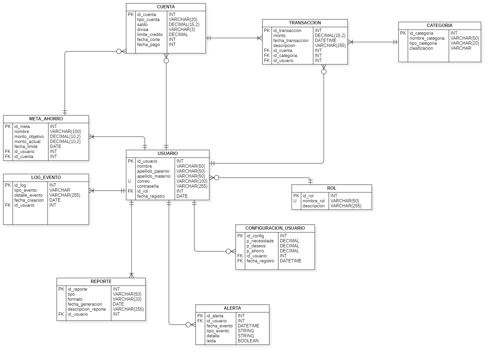

# monedaDOS

<p align="center">
  
</p>

<h3 align="center">Control total de tus finanzas personales</h3>

<p align="center">
  Rastrea ingresos y gastos sin esfuerzo. Obtén control total de tus finanzas y toma mejores decisiones para tu futuro financiero.
</p>

<p align="center">
  
  
  
  
  
</p>

<p align="center">
  · <a href="#acerca-del-proyecto">Acerca del proyecto</a>
  · <a href="#stack-tecnologico">Stack tecnologico</a>
  · <a href="#caracteristicas">Caracteristicas</a>
  · <a href="#estructura-de-la-base-de-datos">Estructura de la base de datos</a>
  · <a href="#primeros-pasos">Primeros pasos</a>
  · <a href="#manual-de-usuario">Manual de usuario</a>
  · <a href="#hoja-de-ruta">Hoja de ruta</a>
  · <a href="#troubleshooting">Troubleshooting</a>
</p>

---

## Acerca del proyecto

**monedaDOS** es una aplicación web para la gestión de finanzas personales, construida con **Spring Boot** y **Thymeleaf**. Permite registrarse, gestionar cuentas (débito, crédito, efectivo) y próximamente registrar cada transacción de ingreso/egreso.

La arquitectura separa lógica de negocio (servicios), acceso a datos (repositorios) y seguridad (Spring Security), sentando base para MVC web y futura **API REST**.

## Stack tecnologico

- **Backend:** Java 17  
- **Framework:** Spring Boot 3.5.6  
- **Acceso a datos:** Spring Data JPA (Hibernate)  
- **Base de datos:** MariaDB (compatible con MySQL)  
- **Seguridad:** Spring Security 6  
- **Autenticación:**  
  - Form Login (sesiones + cookies) para vistas MVC  
  - JWT para endpoints REST bajo `/api/**` (planeado)  
- **Render del Front (SSR):** Thymeleaf  
- **Gestión de dependencias:** Maven  
- **Utilitarios:** Lombok

## Caracteristicas

- **Autenticación completa:** registro, login y logout con Spring Security.  
- **Doble enfoque de seguridad:**  
  - Rutas MVC (`/**`) protegidas con Form Login.  
  - Rutas REST (`/api/**`) con JWT (en roadmap).  
- **Administración de cuentas:** crear y listar cuentas (Efectivo/Débito/Crédito) con validaciones (días de corte/pago).  
- **Lógica de BD:** triggers que actualizan el saldo de la cuenta al insertar/actualizar/eliminar transacciones.  
- **Manejo de errores:** `@ControllerAdvice` y `@RestControllerAdvice` para errores web y API.  
- **Diseño responsivo:** plantillas Thymeleaf limpias y modernas (CSS propio).

## Estructura de la base de datos

Diagrama Entidad–Relación (DER):

<p align="center">
  
</p>

## Primeros pasos

Sigue estas instrucciones para correr el proyecto en tu máquina local.

### Prerrequisitos

- Java **17+**  
- Apache Maven **3.6+**  
- MariaDB **10.4+** (o MySQL **8**)

### 1) Clonar el repositorio

```bash
git clone https://github.com/tu-usuario/monedaDOS.git
cd monedaDOS
````

### 2) Configurar la base de datos

Crea la base de datos `sfp` y ejecuta el script:

```sql
CREATE DATABASE sfp CHARACTER SET utf8mb4 COLLATE utf8mb4_unicode_ci;
```

Ejecuta el contenido de:

```
./src/main/resources/sql/sfp.sql
```

> El script crea tablas, vistas, triggers y datos iniciales (roles, categorías, etc.).

### 3) Configurar la aplicación

Edita `./src/main/resources/application.properties`:

```properties
spring.datasource.url=jdbc:mariadb://localhost:3306/sfp?useSSL=false&serverTimezone=UTC
spring.datasource.username=root
spring.datasource.password=123
spring.jpa.hibernate.ddl-auto=none
spring.jpa.show-sql=false
```

> Ajusta `username` y `password` a tu entorno local.

### 4) Ejecutar

Con Maven Wrapper incluido:

**macOS/Linux**

```bash
./mvnw spring-boot:run
```

**Windows**

```bash
.\mvnw.cmd spring-boot:run
```

La app estará en: [http://localhost:8080](http://localhost:8080)

## Manual de usuario

### 1) Registro de nuevo usuario

* Ve a `http://localhost:8080/login` y entra a “Crear cuenta”, o directo a `http://localhost:8080/register`.
* Completa el formulario (`auth/signup_form.html`) con **Nombre, Apellidos, Email y Contraseña**.
* Tras registrarte, se te redirige al login.

### 2) Inicio de sesión

* Ve a `http://localhost:8080/login` (`auth/login.html`).
* Ingresa **email** y **contraseña**.
* Si es correcto, se redirige al **Panel** (`/panel`).

### 3) Panel de control

* Ruta: `http://localhost:8080/panel` (`home/panel.html`).
* Muestra un resumen estático (Saldo Actual, Ingresos, Gastos).

### 4) Gestión de cuentas

* Navegación → **Cuentas** → `http://localhost:8080/cuentas` (`home/cuentas.html`).
* Verás el listado y tu **Saldo Total** (calculado por `CuentaService.saldoTotal`).
* Para añadir una cuenta, usa la tarjeta “Agregar Nueva Cuenta”:

  * **Nombre** (ej. “Billetera”, “Ahorros”, “TC Nómina”).
  * **Tipo**: `EFECTIVO`, `DEBITO` o `CREDITO`.
  * Si es **CREDITO**, completa **Día de corte** y **Día de pago** (validados en `CuentaDTO`).
* Se hace `POST /cuentas`, se guarda y se recarga la vista.

### 5) Módulos en desarrollo

* **Transacciones** (`/transacciones`): UI lista; conexión al backend en proceso.
* **Reportes** (`/reportes`): UI estática; datos dinámicos en proceso.

### 6) Cerrar sesión

* En el menú de perfil (navbar), elige **Cerrar sesión** (`POST /logout`).
* Spring Security invalida la sesión y te redirige al login con mensaje de éxito.

## Hoja de ruta

* [ ] **Transacciones**: conectar el formulario “Registrar Movimiento” al backend (CRUD completo).
* [ ] **Reportes**: consultas + endpoints para gráficos dinámicos.
* [ ] **Saldos dinámicos**: reflejar cambios en `/cuentas` y `/panel` al registrar movimientos (BD ya lista con triggers).
* [ ] **API REST**: CRUD de Cuentas, Transacciones y Categorías bajo `/api/**` con JWT.

## Troubleshooting

**1) “Error: Rol 'USER' no encontrado.”**
Asegúrate de que el script `sfp.sql` insertó los roles. Si no, inserta uno manualmente:

```sql
INSERT INTO ROL (id, nombre) VALUES (1, 'USER');
```

**2) `LazyInitializationException: Could not initialize proxy ... Rol - no session`**

* Marca el `@ManyToOne` del rol como `fetch = FetchType.EAGER` en `Usuario`, **o**
* “Toca” el rol en el `UserDetailsService` dentro de una transacción `@Transactional(readOnly = true)`:

```java
if (u.getRol() != null) { u.getRol().getNombre(); }
```

**3) `NullPointerException en UserDetailsImpl.getPassword()`**
No guardes la entidad `Usuario` dentro de `UserDetailsImpl`. Mapea a campos inmutables (`username`, `password`, `authorities`) cuando construyas tu `UserDetails`.

**4) El login no reconoce el usuario/contraseña**

* En el formulario de login, los `name` deben ser **exactamente** `username` y `password` si usas el filtro por defecto.
* Si usas `BCryptPasswordEncoder`, la contraseña en BD debe empezar con `$2a$...` (hash). Si guardaste texto plano, no coincidirá.

